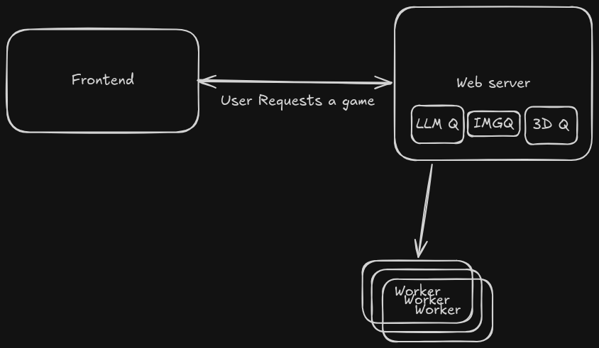

# Architecture

All of the pieces of the system, and how they interact.

## Major Pieces

### Webserver

The webserver is responsible for receiving user requests, handling stripe webhooks, enqueueing
requests to our workers, and running the build gates and python programs. The general flow is a user
request comes in, we debit their account, send their request to the LLM. This builds a design, which
flows back to the webserver, gets saved to the game's directory, and proceeds throughout the build
loops.

Once everything is done, we display on the frontend the build, and the webserver serves up the
finished game on a different domain, embedded in the frontend, to ensure that the game cannot jack
the user's cookies or run any malicious code.

This all runs on a single digital ocean droplet.

### Build Loop

The heart and soul of GameSummoner, the build loop is the process of getting a request -> turning it
into a more fully fledged design -> generating assets -> building the game -> fixing bugs.

### Queues

Our queues are simple queries on the jobs table in our sql database.

| queue | work | target |
|---|---|---|
| `llm` | one build turn | any OpenAI-shaped server |
| `image` | one image render | ComfyUI |
| `mesh` | image → 3D | TRELLIS |
| `video` | image → an animated sprite sheet | ComfyUI — wired, nothing enqueues on it (`docs/models.md`) |

### Workers

The workers are an autoscaled (managed by `src/scaler/autoscaler.py`) group of GPU machines rented
from third party providers, each behind the same seam (`src/scaler/providers.py`): list, a priced
ladder, launch, terminate. Currently RTX PRO 6000s and 5090s on runpod.io, and RTX PRO 6000s
(g7e) on EC2 for the llm queue. A scale-up walks one ladder merged across providers, cheapest
first, and the first rung that takes the launch wins.

### Frontend

We have a react vite frontend that provides several demos of games created with GameSummoner, buy
credits, build and edit games, and play the games you've created.

### Auth

We support traditional email and password, and nothing else.

### Billing

Billing is processed through Stripe.

### Safety

We have a classifier on prompts, images, 3d models and animations. 

### Database

We keep track of everything through a simple sqlite database, which has tables for users, games, and
much more.

### Deploy

The deployment process is an rsync to our digital ocean droplet + docker compose. We also have to
push our docker images for the workers, and fill volumes using s3.
